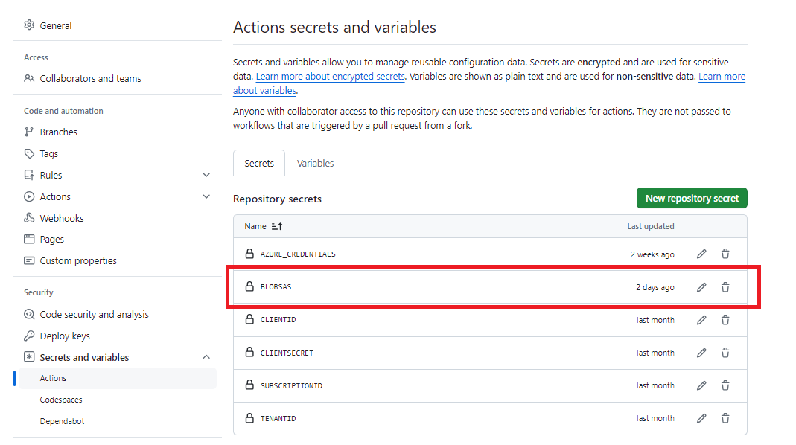

Automating image deployment with HashiCorp Packer using GitHub Actions is a powerful way to streamline your workflow.

Sometimes, you need to pass a GitHub Actions (secret) variable to a PowerShell provisioner script in Hashicorp Packer.

A use case example is if you want to use an Azure Storage Blob Shared Access Signature (SAS) URI as secret in a PowerShell script that downloads software from the Blob storage to the Packer image.
The SAS token is read from the GitHub Actions secret variable and is not in clear text defined in the PowerShell script.

The whole process looks as follows:


## Pre-requested
- A working Packer configuration for image deployment
- Azure Storage Blob account
- In this example we authenticate with a Azure Service Principal. More information can be found [here](https://developer.hashicorp.com/packer/integrations/hashicorp/azure)
- SAS URI access key that grants access to the Blob storage.account. The SAS URI looks like this:
```
https://ibeerens12354.blob.core.windows.net/
?sv=2022-11-02&ss=b&srt=sco&sp=rwdrflaciytfx&23se=2024-05-25T19:30:13Z&st=2024-05-25T11:30:13Z&spr=https&sig=434
```

### Steps
Let's break down the actions in 8 steps:
1. Create a GitHub repository
2. Create a repository secret with the name for example BLOBSAS and paste the SAS URI in the secret field.



3. Configure the GitHub Action. For Packer I use the following GitHub Action: [Setup HashiCorp Packer](https://github.com/marketplace/actions/setup-hashicorp-packer).
4. Packer will read environment variables using the  `PKR_VAR_name` format to find the value for a variable. Add the `'PKR_VAR_blobsas=${{ secrets.BLOBSAS }}'` to the packer build run section

```yaml
jobs:
  packer:
    runs-on: self-hosted
    name: Run Packer
    steps:
      - name: Checkout
        uses: actions/checkout@v4
      - name: Setup `packer`
        uses: hashicorp/setup-packer@main
        id: setup
        with:
          version: ${{ env.PRODUCT_VERSION }}
      - name: Run `packer init`
        id: init
        run: "packer init ./packer/windows11.json.pkr.hcl"
      - name: Run `packer build`
        id: build
        run: "packer build -force -var-file='./packer/variables.pkr.hcl' -var 'client_id=${{ secrets.CLIENTID }}' -var 'client_secret= ${{ secrets.CLIENTSECRET }}' -var 'subscription_id=${{ secrets.SUBSCRIPTIONID }}' -var 'tenant_id=${{ secrets.TENANTID }}' -var 'PKR_VAR_blobsas=${{ secrets.BLOBSAS }}' './packer/windows11.json.pkr.hcl'"
```

5. In the Packer configuration add the following empty variable:

```hcl
variable "PKR_VAR_blobsas" {
  type    = string
}
```

6. In the Packer configuration, add the PowerShell provisioner, add an environment variable and point to location of the script that downloads the software.

```yaml
  provisioner "powershell" {
    environment_vars = ["saskey=${var.PKR_VAR_blobsas}"]
    script = "./packer/scripts/DownloadSoftware.ps1"
  }
```

7. In the `DownloadSoftware.ps1` PowerShell script I use the Azcopy  binary to download the software from the Azure Storage Blob to the Packer image.

```powershell
.\azcopy.exe cp $Env:saskey "c:\apps\" --recursive
```

8. Start the GitHub Action to start the image deployment and checks if the software is downloaded from the Azure Storage blob.

### Conclusion

With these steps it is easy to pass (secret) variables from a GitHub Action inside a Packer PowerShell provisioner. This can be useful for passing passwords for example.