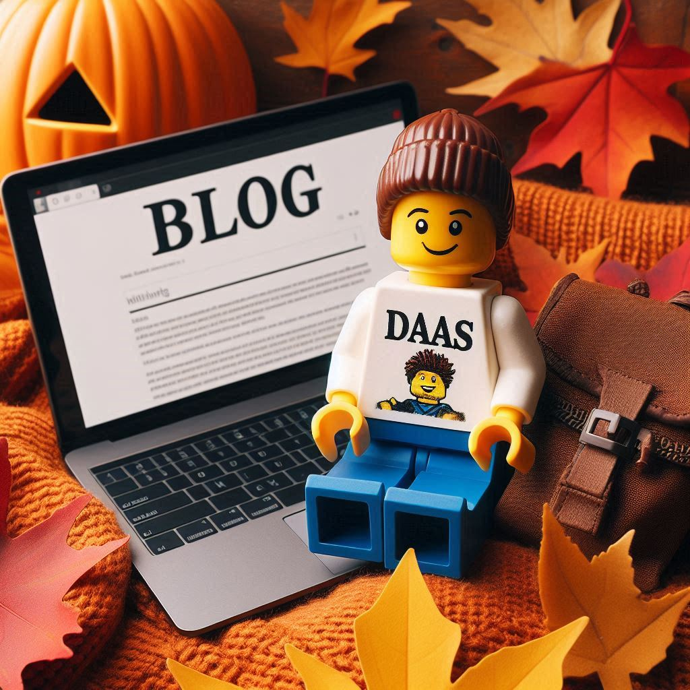

Welcome to our **monthly roundup** of the hottest tech updates in the worlds of Microsoft Azure (Windows 365, Azure Virtual Desktop, Cloud PC, and infrastructure), VMware by Broadcom, Omnissa, GitHub, HashiCorp, Azure DevOps, and other partners. This series will have must-read articles, each offering a deep dive into these cutting-edge platforms' latest technological advancements, news, and trends.

In today’s fast-paced tech landscape, staying informed is key! That’s why we’re here to make it easy for you. Each month, we’ll handpick the most insightful and informative articles that covers:
- DAAS, VDI, End User Computing (EUC), Endpoint Management and Apps
- Cloud
- Virtualization
- Infrastructure As Code (IaC)/DevOps

**So let’s dive again into this months top tech insights.**

---
## **DAAS / VDI / EUC / ENDPOINT / APPS MANAGEMENT**
---

### **General**
- Automation Framework Windows Image Creation on Microsoft Azure for Citrix / AVD. [**Learn more**](https://www.youtube.com/watch?v=iwfIhLTgdZ8)
- Smart card redirection support for YubiKeys in Windows App on iOS. [**Learn more**](https://techcommunity.microsoft.com/t5/windows-it-pro-blog/smart-card-redirection-support-for-yubikeys-in-windows-app-on/ba-p/4281574)
- PSAppDeployToolkit v4 – What’s New and Why You Should Upgrade. [**Learn more**](https://patchmypc.com/psadt-v4)
- Boost Performance in Azure Virtual Desktop & Windows 365 with Multimedia Redirection! [**Learn more**](https://www.youtube.com/watch?v=u7mXZl3nc9s)
- Actual Quick Fixes for Teams 2.0 VDI - Pain Points. [**Learn more**](https://oberrauch.bz.it/2024/10/16/actual-quick-fixes-for-teams-2-0-vdi-pain-points-2/)
- Master Microsoft Azure DevBox Insights in 15 Minutes. [**Learn more**](https://www.youtube.com/watch?v=XzbmeeaRRfM)
- Configuring the Session Lock Behavior. [**Learn more**](https://www.beckmann.ch/blog/2024/10/08/configuring-the-session-lock-behavior/?lang=en)
- NVIDIA vGPU 17.4 released. Adds support for Horizon 2406, Citrix Virtual Apps and Desktops 7 2407, security updates, and bug fixes! [**Learn more**](https://docs.nvidia.com/vgpu/17.0/whats-new-vgpu/index.html)

### **Azure Virtual Desktop (AVD)**
- AVD Community newsLetters. [**Learn more**](https://avdcommunity.com/)
- Session host update for Azure Virtual Desktop (preview). [**Learn more**](https://learn.microsoft.com/en-us/azure/virtual-desktop/session-host-update)
- Azure Virtual Desktop - Black Screens on logins - What we've tried so far. [**Learn more**](https://techcommunity.microsoft.com/t5/azure-virtual-desktop/azure-virtual-desktop-black-screens-on-logins-what-we-ve-tried/m-p/4250228/page/5)
- Watch Me Set Up A Full Azure Virtual Desktop deployment in Just 90 Minutes! [**Learn more**](https://youtu.be/4wAXSUYrr7I?si=vemevZ5-pUWCGeU7)
- I QUIT Patching Windows And You Should Too! [**Learn more**](https://youtu.be/ZW9tleDFIs8?si=unMj60LrF1ZlRA21)
- Setting Up AVD Insights for Effective Monitoring of Your Azure Virtual Desktop Environment. [**Learn more**](https://www.azuretechlead.com/2024/10/setting-up-avd-insights-for-effective.html)
- Azure Virtual Desktop Session Host Update. [**Learn more**](https://youtu.be/tBsFTnm4Z4c?si=meqG18SkqwOGsqOE)
- AVD Deep Insights workbook update, Added Show "TURN" in session bandwidth and latency. [**Learn more**](https://blog.itprocloud.de/AVD-Azure-Virtual-Desktop-Error-Drill-Down-Workbook/)
- Entra Dynamic Device Groups for Azure Virtual Desktop - Host Pools, Resource Groups and Subscriptions. [**Learn more**](https://blog.itprocloud.de/Dynamic-Device-Group-host-pool-session-host-resource-group/)
- Azure Virtual Desktop App Attach Create with Teams S1E1. [**Learn more**](https://youtu.be/xcwM-iCcsi0?si=T6i_QzH1nlETzzn3)
- How to configure Remote App and App Attach permissions correctly S1E2. [**Learn more**](https://youtu.be/oMvalXGSU68?si=1AAf4HDGsMxXfth2)
- How to update your App Attach application S1 E3. [**Learn more**](https://youtu.be/LSb-LGVvnag?si=4j8x_1Ko24kSfmkg)

### **Windows 365 (W365) / CloudPC**
- The latest weekly W365 newsletter. [**Learn more**](https://w365community.com/)
- What's new in Windows 365 Enterprise. [**Learn more**](https://learn.microsoft.com/en-us/windows-365/enterprise/whats-new#week-of-april-1-2024)
- What is Windows 365 Frontline? [**Learn more**](https://learn.microsoft.com/en-us/windows-365/enterprise/introduction-windows-365-frontline)
- Updating Windows 365 Cloud PCs to Windows 11 24H2. [**Learn more**](https://dominiekverham.com/updating-windows-365-cloud-pcs-to-windows-11-24h2/)
- Windows 365 migration: It's easier than you think. [**Learn more**](https://techcommunity.microsoft.com/t5/windows-it-pro-blog/windows-365-migration-it-s-easier-than-you-think/ba-p/4265938)

### **VMware EUC / Horizon / Omnissa**
- Weekly VMware Enduser Computing Updates by Julius Lienemann. [**Learn more**](https://juliuslienemann.wordpress.com/)
- Omnissa weekly EUC newsletter. [**Learn more**](https://blog.simonelberts.nl/)
- VMware Horizon Client for Windows 2406.1. [**Learn more**](https://customerconnect.omnissa.com/downloads/details?downloadGroup=CART25FQ2_WIN_2406.1&productId=1027&rPId=118762)
- VDI Blast Configurator. [**Learn more**](https://vdihub.fr/blast-configurator/)
- Omnissa Horizon combined offering with VMware vSphere Foundation for VDI. [**Learn more**](https://static.omnissa.com/sites/default/files/VVF-for-VDI-FAQ.pdf)
- Horizon Powershell Module. [**Learn more**](https://developer.omnissa.com/horizon-powercli/)
- Omnissa announces Limited Availability for Horizon 8 with VCD. [**Learn more**](https://techzone.omnissa.com/blog/horizon-8-and-vcd-integration-limited-availability)

### **Intune**
- Weekly Intune newsletter by Andrew Taylor. [**Learn more**](https://andrewstaylor.com/category/newsletter/)
- What's new in Microsoft Intune October 2024 [**Learn more**](https://techcommunity.microsoft.com/t5/microsoft-intune-blog/what-s-new-in-microsoft-intune-october-2024/ba-p/4273353)
- Rock my printers. [**Learn more**](https://www.rockenroll.tech/2023/03/14/rock-my-printers/)
- Connect to Cloud PCs from Windows 10 kiosks using Windows App. [**Learn more**](https://techcommunity.microsoft.com/t5/windows-it-pro-blog/connect-to-cloud-pcs-from-windows-10-kiosks-using-windows-app/ba-p/4274384)
- Easily managing Personal Data Encryption for known Windows folders. [**Learn more**](https://petervanderwoude.nl/post/easily-managing-personal-data-encryption-for-known-windows-folders/)

### **MSIX App Attach / WinGet**
- Windows Package Manager 1.9.25180 available. [**Learn more**](https://github.com/microsoft/winget-cli/releases/tag/v1.9.25180)

---
## **Microsoft Azure**
---

### **Microsoft 365 / Entra / AD**
- Entra.News - Your weekly dose of Microsoft Entra. [**Learn more**](https://entra.news/)
- Password Reset PROBLEMS? Microsoft Entra Has the Solution! [**Learn more**](https://www.youtube.com/watch?v=JyzzAzMQphg)
- Gone in 60 Seconds… How Azure AD / Entra ID Tenants are Compromised. [**Learn more**](https://youtu.be/w8JY1McMvHI?si=-s7SS11dETlKMmHk)
- How is Entra Conditional Access Central to Securing M365? [**Learn more**](https://youtu.be/zHOc5ugZ7gk?si=d2UnK9yehtyhRHZw)
- M365 Security Testing with Maester. [**Learn more**](https://www.edtechirl.com/p/m365-security-testing-with-maester?r=ef58q&utm_campaign=post&utm_medium=web&triedRedirect=true)
- Hardening Entra ID. [**Learn more**](https://www.infernux.no/EntraID-GeneralHardening/)
- Active Directory Hardening Series - Part 1 – Disabling NTLMv1. [**Learn more**](https://techcommunity.microsoft.com/t5/core-infrastructure-and-security/active-directory-hardening-series-part-1-disabling-ntlmv1/ba-p/3934787)
- Active Directory Hardening Series - Part 2 – Removing SMBv1. [**Learn more**](https://techcommunity.microsoft.com/t5/core-infrastructure-and-security/active-directory-hardening-series-part-2-removing-smbv1/ba-p/3988317)
- Active Directory Hardening Series - Part 3 – Enforcing LDAP Signing. [**Learn more**](https://techcommunity.microsoft.com/t5/core-infrastructure-and-security/active-directory-hardening-series-part-3-enforcing-ldap-signing/ba-p/4066233)
- Active Directory Hardening Series - Part 4 – Enforcing AES for Kerberos. [**Learn more**](https://techcommunity.microsoft.com/t5/core-infrastructure-and-security/active-directory-hardening-series-part-4-enforcing-aes-for/ba-p/4114965)
- Active Directory Hardening Series - Part 5 – Enforcing LDAP Channel Binding. [**Learn more**](https://techcommunity.microsoft.com/t5/core-infrastructure-and-security/active-directory-hardening-series-part-5-enforcing-ldap-channel/ba-p/4235497)
- Active Directory Hardening Series - Part 6 – Enforcing SMB Signing. [**Learn more**](https://techcommunity.microsoft.com/t5/core-infrastructure-and-security/active-directory-hardening-series-part-6-enforcing-smb-signing/ba-p/4272168)
- Conditional Access framework and policies. [**Learn more**](https://learn.microsoft.com/en-us/azure/architecture/guide/security/conditional-access-framework)

### **Microsoft Azure**
- John Savill's Weekly Update. [**Learn more**](https://www.youtube.com/playlist?list=PLlVtbbG169nGL0hj1CeL2Zjmr73SmXIpc)
- Getting the right Foundation – what makes a GREAT Landing Zone?. [**Learn more**](https://jakewalsh.co.uk/getting-the-right-azure-foundation-what-makes-a-great-landing-zone-technical-summit/)
- Unmasking DNS Timeouts: The Hidden Culprit in Azure Virtual Networks. [**Learn more**](https://techcommunity.microsoft.com/t5/core-infrastructure-and-security/unmasking-dns-timeouts-the-hidden-culprit-in-azure-virtual/ba-p/4250444)
- Benchmarking 6th gen. Intel-based Dv6 (preview) VM SKUs for HPC Workloads in Financial Services. [**Learn more**](https://techcommunity.microsoft.com/t5/azure-high-performance-computing/benchmarking-6th-gen-intel-based-dv6-preview-vm-skus-for-hpc/ba-p/4272738)
- Azure Orphan Resources Grafana Dashboard. [**Learn more**](https://techcommunity.microsoft.com/t5/azure-for-isv-and-startups/azure-orphan-resources-grafana-dashboard/ba-p/4120303?WT.mc_id=MVP_416291)
- Routing options for VMs from Private Subnets. [**Learn more**](https://techcommunity.microsoft.com/t5/azure-networking-blog/routing-options-for-vms-from-private-subnets/ba-p/4271244)
- Azure IP Addressing & Subnetting Basics: Avoid Overlapping IPs in VNets. [**Learn more**](https://www.youtube.com/watch?v=3ZD8kBS_OzM)
- Securing service principals in Azure. [**Learn more**](https://marcogerber.ch/securing-service-principals-in-azure/)
- Azure Stack HCI Day 2 Operations. [**Learn more**](https://schmitt-nieto.com/blog/azure-stack-hci-day2/)
- Deploy Azure Arc gateway (Limited preview 2024). [**Learn more**](https://www.linkedin.com/pulse/deploy-azure-arc-gateway-limited-preview-2024-andreas-hartig-sbo8f/?trackingId=Jh%2Bz20kFQqiHXR4bDjta%2BA%3D%3D)
- New features for Azure Virtual Desktop for Azure Stack HCI. [**Learn more**](https://techcommunity.microsoft.com/t5/azure-virtual-desktop-blog/new-features-for-azure-virtual-desktop-for-azure-stack-hci/ba-p/4273496)
- Identify Azure cloud waste. [**Learn more**](https://www.cloudcoffeebreak.com/2024/10/16/azure-cost-optimization-part-3-identify-cloud-waste.html)
- All About Azure Storage SAS Tokens. [**Learn more**](https://www.nathannellans.com/post/all-about-azure-storage-sas-tokens)

### **Windows**
- What's new in Windows Server 2025 (preview). [**Learn more**](https://learn.microsoft.com/en-us/windows-server/get-started/whats-new-windows-server-2025)
- Windows Server 2025 Comparison Guide. [**Learn more**](https://www.linkedin.com/posts/svenlangenfeld_windows-server-2025-comparison-guide-activity-7257072617067597824-yuL8?utm_source=share&utm_medium=member_desktop)
- Windows 11, version 24H2: What’s new for IT pros. [**Learn more**](https://techcommunity.microsoft.com/t5/windows-it-pro-blog/windows-11-version-24h2-what-s-new-for-it-pros/ba-p/4259108)
- Windows 11, version 24H2 improved update fundamentals. [**Learn more**](https://techcommunity.microsoft.com/t5/windows-it-pro-blog/windows-11-version-24h2-improved-update-fundamentals/ba-p/4274431)
- Administrative Templates (.admx) for Windows 11 2024 Update (24H2). [**Learn more**](https://www.microsoft.com/en-us/download/details.aspx?id=106254)
- Windows 11 24H2 is available, but, [**Learn more**](https://oofhours.com/2024/10/30/windows-11-24h2-is-available-but/)
- Deep Dive into Windows Sudo. [**Learn more**](https://mobile-jon.com/2024/10/14/deep-dive-into-windows-sudo/)

---
## **VMware by Broadcom**
---
- VMware Tools 12.5.0 Release Notes. [**Learn more**](https://docs.vmware.com/en/VMware-Tools/12.5/rn/vmware-tools-1250-release-notes/index.html)
- Monitoring VMware vSphere with Zabbix. [**Learn more**](https://vmattroman.com/monitoring-vmware-vsphere-with-zabbix/)
- Recovering ESXi 7.x & 8.x host after forgetting or losing root password. [**Learn more**](https://williamlam.com/2024/10/recovering-esxi-7-x-8-x-host-after-forgetting-or-losing-root-password.html)
- Updated Dashboard for VMware Community Homelabs using Dashimo. [**Learn more**](https://williamlam.com/2024/10/updated-dashboard-for-vmware-community-homelabs-using-dashimo.html)
- Automated VMware Cloud Foundation Lab Deployment including VCF 5.2.1 support. [**Learn more**](https://github.com/lamw/vcf-automated-lab-deployment)

---
## **Infrastructure as Code (IaC) / DevOps**
---

### **General**
- Hashi conf 2024 wrap up. [**Learn more**](https://nedinthecloud.com/2024/10/18/hashiconf-2024-wrap-up/)
- Build a Self-Service Access Management Solution with GitHub and Boundary [HashiConf 2024]. [**Learn more**](https://mattias.engineer/blog/2024/hashiconf/)
- Setting up HashiCorp Packer with Proxmox Part 1: Build a Baseline Ubuntu Image from Installation Media ISO. [**Learn more**](https://medium.marktinderholt.com/setting-up-hashicorp-packer-with-proxmox-part-1-build-a-baseline-ubuntu-image-from-installation-65c2bb4d9118)
- How to Create a Free Ansible Lab in Public Cloud. [**Learn more**](https://www.youtube.com/watch?v=eHj2NATil5M&lc=Ugx1USyU-g-v6E7PWut4AaABAg)
- Using HashiCorp Boundary to securely access Windows Server remote management. [**Learn more**](https://blog.graa.dev/Boundary-WindowsManagement)

### **GitHub**
- GitHub Copilot for Azure VScode extension. [**Learn more**](https://marketplace.visualstudio.com/items?itemName=ms-azuretools.vscode-azure-github-copilot)
- GitHub + Microsoft Teams Integration. [**Learn more**](https://github.com/integrations/microsoft-teams/blob/master/Readme.md#subscribe-notifications)

### **Hashicorp Terraform**
- Unlocking the Best of Azure with AzureRM and AzAPI Providers. [**Learn more**](https://techcommunity.microsoft.com/t5/azure-tools-blog/unlocking-the-best-of-azure-with-azurerm-and-azapi-providers/ba-p/4283264)
- Announcing AzAPI 2.0. [**Learn more**](https://techcommunity.microsoft.com/t5/azure-tools-blog/announcing-azapi-2-0/ba-p/4275733)
- Getting Started with Terraform Stacks. [**Learn more**](https://youtu.be/LMVo_Twzid8?si=3iyqHUe9uEoblj6b)
- Let's Do DevOps: Updating Your TF and Action Dependencies on GitHub Repos with Dependabot. [**Learn more**](https://www.letsdodevops.com/p/lets-do-devops-updating-your-tf-and?triedRedirect=true)
- Alas poor null provider! I knew him, Horatio. [**Learn more**](https://medium.com/azure-terraformer/alas-poor-null-provider-i-knew-him-horatio-0115542798a7)
- Building a Baseline Azure Environment with Terraform. [**Learn more**](http://www.marktinderholt.com/infrastructure-as-code/terraform/azure/cloud/2024/10/27/azure-baseline-env.html)
- How I passed the Terraform Authoring Operations Professional exam. [**Learn more**](https://medium.com/@wendellbarcellos/how-i-passed-the-terraform-authoring-operations-professional-exam-329be465e4eb)
- Let's Talk About Blob Storage Container Role Assignments. [**Learn more**](http://www.marktinderholt.com/infrastructure-as-code/terraform/azure/cloud/2024/10/25/blob-storage-container-rbac.html)
- How to Pass GitHub Actions Certification Exam: My Own Certification Journey. [**Learn more**](https://rehababotalep.github.io/posts/github-actions-exam/)

### **PowerShell / Azure Cloud Shell / Bicep**
- Azure Deployment GitHub Action for Bicep. [**Learn more**](https://github.com/Azure/bicep-deploy)
- Query WinGet software installer data with PowerShell. [**Learn more**](https://powershellisfun.com/2024/10/17/query-winget-software-installer-data-with-powershell/)
- Automatically renew access token during script execution in PowerShell. [**Learn more**](https://powershell.works/2024/10/10/automatically-renew-access-token-during-script-execution-in-powreshell/)

### **Other**
-  SignToolGUI tool,  a tool that streamlines the process of digitally signing. [**Learn more**](https://github.com/michaelmsonne/SignToolGUI)

---
## **Upcomming Events**
---
- VMware Explore Europe, 4-7 November 2024, Barcelona. [**Learn more**](https://www.vmware.com/explore/eu)
- Microsoft Ignite, 19-21 November 2024, Chicago or Online. [**Learn more**](https://ignite.microsoft.com/en-US/home)