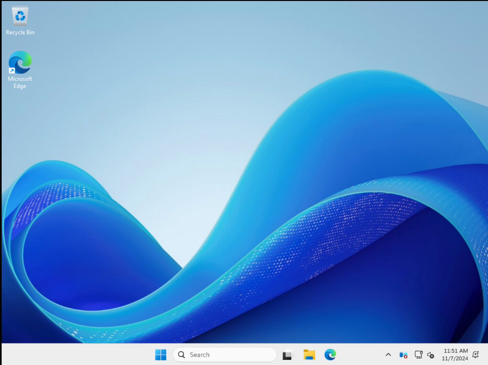
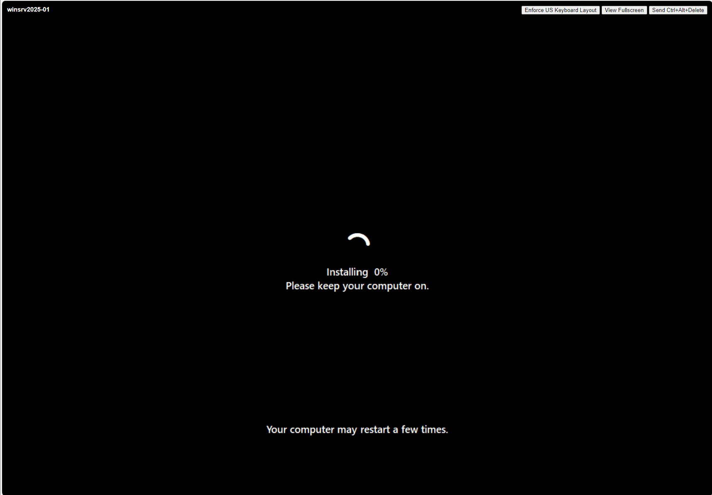
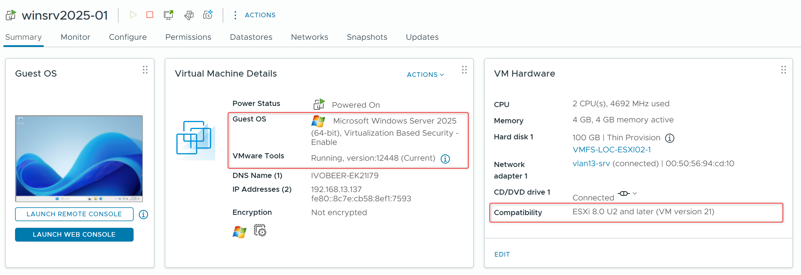

Last week Windows Server 2025 became Generally Available (GA). To create a Windows Server 2025 image I use HashiCorp Packer.

## What is Packer?
Packer is free and open-source software. It's developed and maintained by HashiCorp. You can download it for free and use it without any licensing fees. Packer has the following capabilities:

- **Creates Machine Images:** Packer builds machine images for various platforms (e.g., VMware, Hyper-V, AWS, Azure) from a single source configuration.
- **Configuration-Driven:** Packer uses configuration files (typically in HCL format) to define the build process, including the source image, provisioning steps, and output formats.
- **Provisioning:** Packer supports various provisioning methods to customize the image, such as shell scripts, Ansible playbooks, PowerShell scripts, and more.
- **Platform Agnostic:** You can use the same configuration to build images for multiple platforms, ensuring consistency.
- **Automation:** Packer automates the image building process, reducing manual effort and potential errors.
- **Version Control:** Packer configurations can be version controlled, allowing for reproducible builds and easier collaboration.
- **Testing and Validation:** You can integrate testing and validation steps into your Packer builds to ensure image quality.
- **Continuous Integration/Continuous Delivery (CI/CD):** Packer can be integrated into CI/CD pipelines to automate image building as part of your software delivery process.

In this blog post, I show how to deploy Windows Server 2025 with Desktop Experience enabled running as VM within VMware ESXi 8.



## Key Features: 
- Operating System: Microsoft Windows Server 2025 (64-bit)
- Hardware:
    - **vCPUs:** 2
    - **Memory:** 4 GB
    - **Disk:** 100 GB (thin provisioned)
    - **Virtualization-Based Security (VBS):** Enabled
    - **Network Adapter:** VMXNET3
- The latest Windows Updates are installed.


- VMware Compatibility: Tested with VMware vSphere 8 (Hardware version 21)
- The VMware PVSCSI (VMware Paravirtual) driver is included in the Windows Server 2025 ISO image, there is no need to select or install the PVSCSI driver from additional media now.
- VMware Tools: Automatically installed (version 12.5.0 with day-zero support for Windows Server 2025)
- Remote Access: OpenSSH (default in Windows Server 2025) used by Packer (instead of using WINRM).
- Package Management: WinGet is fully supported for easy software installation and updates (e.g., ```Winget Upgrade -all```)



## Notes:
- Refer to the hardware requirements for Windows Server 2025 for optimal performance: [link](https://learn.microsoft.com/en-us/windows-server/get-started/hardware-requirements?tabs=ram&pivots=windows-server-2025)
- Adjust the variables file in (```win2025-std.auto.pkvars.hcl```) to customize the VM configuration according to your needs. 
- If Windows Server 2025 (64-bit) is unavailable (depends on the VMware ESXi version) use Microsoft Windows Server 2022 (64-bit) as Guest OS. This can be checked using the following script [link](https://github.com/ibeerens/PowerCLI/blob/master/esxi-list-available-osguests-ids.ps1)

## Configuration
1. Download the latest Packer binary. [link](https://www.ivobeerens.nl/2023/09/22/download-the-latest-hashicorp-terraform-packer-and-vault-bits/)
2. Adjust the variables in the ```win2025-std.auto.pkvars.hcl``` file
3. Adjust the passwords in the ```autounattended.xml``` (lines 138 and 177)
4. Adjust the passwords in locals in the ```win2025-std.config.pkr.hcl```. Make sure the SSHUser and SSHPass match the username and password in the ```autounattended.xml file```.
5. The KMS keys for Windows Server 2025 can be found here: [link](https://learn.microsoft.com/en-us/windows-server/get-started/kms-client-activation-keys?tabs=server2025%2Cwindows1110ltsc%2Cversion1803%2Cwindows81)
6. Adjust the variables and run the commands in the ```build.ps1``` file

Find the Packer configuration for Windows Server 2025 in my **GitHub** repo [link](https://github.com/ibeerens/packer/tree/main/vsphere/winsrv2025)