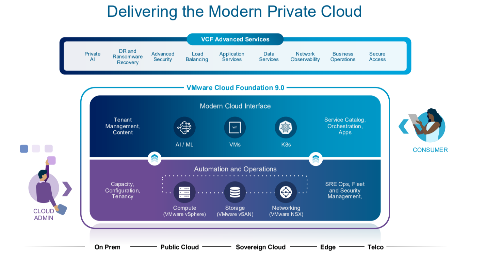

VMware Cloud Foundation (VCF) 9 is the latest release of VMware’s integrated software platform for building and managing hybrid cloud environments. VCF 9 brings together compute, storage, networking, and cloud management into a single, automated stack, making it easier for organizations to deploy and operate private and hybrid clouds.

Key highlights of VCF 9 include enhanced automation, improved lifecycle management, advanced security features, and support for the latest hardware and software innovations. With VCF 9, businesses can accelerate their digital transformation, simplify operations, and ensure consistent infrastructure and operations across private and public clouds.

Whether you are modernizing your data center or building a hybrid cloud, VMware Cloud Foundation 9 provides a robust, scalable, and secure foundation for your cloud journey.

VMware Cloud Foundation (VCF) is released on June 17, 2025. Here is an overview of the latest resources about VCF 9.0.

Last updated: **June 16, 2025.**

<!-- [**Read the article**]() -->

## General
- What’s New in VMware Cloud Foundation 9.0. [**Read the article**](https://blogs.vmware.com/cloud-foundation/2025/06/17/whats-new-in-vmware-cloud-foundation-9-0/)
- Announcing VMware vSphere Foundation 9.0 – Smarter Operations, Better Performance, Stronger Security. [**Read the article**](https://blogs.vmware.com/cloud-foundation/2025/06/17/now-available-vmware-vsphere-foundation-9-0/)
- Finally Released – VCF 9 and the Comeback of Private Cloud. [**Read the article**](https://vlenzker.net/2025/06/finally-released-vcf-9-and-the-comeback-of-private-cloud/)
- VMware Cloud Foundation 9 Unpacked: A Technical Breakdown. [**Watch the video**](https://www.youtube.com/watch?v=CM9ID86HOI0&ab_channel=VMwareCloudFoundation)
- VMware Cloud Foundation VCF 9.0 Released New Features. [**Read the article**](https://www.virtualizationhowto.com/2025/06/vmware-cloud-foundation-vcf-9-0-released-new-features/)
- VCF 9 Youtube series. [**Watch the movies**](https://www.youtube.com/playlist?list=PL8_k3uUCO39t-8kKT6u8Ghvos4TvRyEp5)
- Advanced Memory Tiering Now Available with VMware Cloud Foundation 9.0. [**Read the article**](https://blogs.vmware.com/cloud-foundation/2025/06/19/advanced-memory-tiering-now-available/)

## Deprecation Notes / End of Support Notes:
- VMware Cloud Foundation 9.0 - vSphere. [**Read the article**](https://techdocs.broadcom.com/us/en/vmware-cis/vcf/vcf-9-0-and-later/9-0/release-notes/vmware-cloud-foundation-90-release-notes/platform-product-support-notes/product-support-notes-vsphere.html)
- VMware Cloud Foundation 9.0 - vSAN. [**Read the article**](https://techdocs.broadcom.com/us/en/vmware-cis/vcf/vcf-9-0-and-later/9-0/release-notes/vmware-cloud-foundation-90-release-notes/platform-product-support-notes/product-support-notes-vsan.html)
- VMware Cloud Foundation 9.0 - NSX. [**Read the article**](https://techdocs.broadcom.com/us/en/vmware-cis/vcf/vcf-9-0-and-later/9-0/release-notes/vmware-cloud-foundation-90-release-notes/platform-product-support-notes/product-support-notes-nsx.html)
- VMware Cloud Foundation 9.0 - VCF Installer. [**Read the article**](https://techdocs.broadcom.com/us/en/vmware-cis/vcf/vcf-9-0-and-later/9-0/release-notes/vmware-cloud-foundation-90-release-notes/platform-product-support-notes/product-support-notes-installer.html)
- VMware Cloud Foundation 9.0 - VCF Operations. [**Read the article**](https://techdocs.broadcom.com/us/en/vmware-cis/vcf/vcf-9-0-and-later/9-0/release-notes/vmware-cloud-foundation-90-release-notes/platform-product-support-notes/product-support-notes-vcf-ops.html)
- VMware Cloud Foundation 9.0 - VCF Automation. [**Read the article**](https://techdocs.broadcom.com/us/en/vmware-cis/vcf/vcf-9-0-and-later/9-0/release-notes/vmware-cloud-foundation-90-release-notes/platform-product-support-notes/product-support-notes-vcf-automation.html)
- VMware Cloud Foundation 9.0 - VCF SDKs, APIs, and CLIs. [**Read the article**](https://techdocs.broadcom.com/us/en/vmware-cis/vcf/vcf-9-0-and-later/9-0/release-notes/vmware-cloud-foundation-90-release-notes/platform-product-support-notes/vcf-sdks-apis-and-clis-product-support-notes.html)

## Known Issues:
- VMware Cloud Foundation 9.0 - vSphere. [**Read the article**](https://techdocs.broadcom.com/us/en/vmware-cis/vcf/vcf-9-0-and-later/9-0/release-notes/vmware-cloud-foundation-90-release-notes/component-specific/vsphere-90-known-issues.html)
- VMware Cloud Foundation 9.0 - vSAN. [**Read the article**]()
- VMware Cloud Foundation 9.0 - NSX. [**Read the article**]()
- VMware Cloud Foundation 9.0 - VCF Installer. [**Read the article**]()
- VMware Cloud Foundation 9.0 - VCF Operations. [**Read the article**]()
- VMware Cloud Foundation 9.0 - VCF Automation. [**Read the article**]()
- VMware Cloud Foundation 9.0 - VCF SDKs, APIs, and CLIs. [**Read the article**]()

## Homelab
- NVMe Tiering with AMD Ryzen CPU workaround for VCF 9.0. [**Read the article**](https://williamlam.com/2025/06/nvme-tiering-with-amd-ryzen-cpu-workaround-for-vcf-9-0.html)
- vSAN ESA Disk & HCL Workaround for VCF 9.0. [**Read the article**](https://williamlam.com/2025/06/vsan-esa-disk-hcl-workaround-for-vcf-9-0.html)
- Disable 10GbE NIC Pre-Check in the VCF 9.0 Installer. [**Read the article**](https://williamlam.com/2025/06/disable-10gbe-nic-pre-check-in-the-vcf-9-0-installer.html)
- Minimal resources for deploying VCF 9.0 in a Lab. [**Read the article**](https://williamlam.com/2025/06/minimal-resources-for-deploying-vcf-9-0-in-a-lab.html)
- Using HTTP with VCF 9.0 Installer for Offline Depot. [**Read the article**](https://williamlam.com/2025/06/using-http-with-vcf-9-0-installer-for-offline-depot.html)
- Crowdsourced Lab Hardware for ESXi 9.0 Dashboard. [**Read the article**](https://williamlam.com/2025/06/crowdsourced-lab-hardware-for-esxi-9-0-dashboard.html)
- VCF 9.0 Hardware Considerations. [**Read the article**](https://williamlam.com/page/4)
- NVMe Tiering with Nested Virtualization in VCF 9.0. [**Read the article**](https://williamlam.com/2025/06/nvme-tiering-with-nested-virtualization-in-vcf-9-0.html)
- VCF 9.0 Installer workaround for ESXi hosts with different vendor. [**Read the article**](https://williamlam.com/2025/06/vcf-9-0-installer-workaround-for-esxi-hosts-with-different-vendor.html)
- Failed to locate kickstart on Nested ESXi VM CD-ROM in VCF 9.0. [**Read the article**](https://williamlam.com/2025/06/failed-to-locate-kickstart-on-nested-esxi-vm-cd-rom-in-vcf-9-0.html)
- PowerCLI remediation script for running NSX Edge on AMD Ryzen for VCF 9.0. [**Read the article**](https://williamlam.com/2025/06/powercli-remediation-script-for-running-nsx-edge-on-amd-ryzen-for-vcf-9-0.html)

## VCF 9 - Licensing
vSphere Standard and vSphere Enterprise Plus are only available as versions up to the 8 Update 3 release currently, vSphere 9.0 features are only available as part of VMware vSphere Foundation 9.0 and VMware Cloud Foundation 9.0. To get VCF 9 you need a new subscription license. Existing customers with licenses from pre-Broadcom will not be able to upgrade before a new agreement is signed.
- VMware vSphere Product Line Comparison. [**Read the article**](https://www.vmware.com/docs/vmw-datasheet-vsphere-product-line-comparison)
- VCF 9.0 Licensing. Simplified. Real talk on what VCF licensing looks like now. [**Read the article**](https://www.linkedin.com/pulse/vcf-90-licensing-simplified-real-talk-what-looks-like-kusek-hn5vc/)
- What's Inside a VCF 9 License File? Understanding Connected vs. Disconnected Registration. [**Read the article**](https://www.linkedin.com/pulse/whats-inside-vcf-9-license-file-understanding-connected-kusek-95gfc/)
### VCF Licensing videos:
- VCF License Overview. [**Read the article**](https://lnkd.in/eb49BfQr)
- VCF Register Instance. [**Read the article**](https://lnkd.in/esGuZbhh)
- VCF License Management. [**Read the article**](https://lnkd.in/e9D2eK5X)
- VCF Usage Analytics. [**Read the article**](https://lnkd.in/ekGxcX8q)
- VCF Tenant Access. [**Read the article**](https://lnkd.in/ea_GQ6XA)
- VCF Licensing Guide. [**Read the article**](https://lnkd.in/edCBzzSC)

## vSAN 9.0
- Introducing vSAN 9.0! [**Read the article**](https://www.yellow-bricks.com/2025/06/18/introducing-vsan-9-0/)

## VMware Cloud Foundation 9.0 Hands-on Labs
- What’s New in VMware Cloud Foundation 9.0 - Platform (HOL-2610-01-VCF-L). [**Read the article**](https://labs.hol.vmware.com/HOL/catalog/lab/26715)
- What’s New in VMware Cloud Foundation 9.0 - Automation (HOL-2610-02-VCF-L). [**Read the article**](https://labs.hol.vmware.com/HOL/catalog/lab/26716) 
- What’s New in VMware Cloud Foundation 9.0 - Operations (HOL-2610-03-VCF-L). [**Read the article**](https://labs.hol.vmware.com/HOL/catalog/lab/26717)
- Unifying VM and Kubernetes Management with vSphere Supervisor in VMware Cloud Foundation 9.0 (HOL-2633-01-VCF-L). [**Read the article**](https://labs.hol.vmware.com/HOL/catalog/lab/26719)
- What's New with vSphere in VMware Cloud Foundation 9.0 (HOL-2630-01-VCF-L). [**Read the article**](https://labs.hol.vmware.com/HOL/catalog/lab/26718)
- Overview of all VMware Cloud Foundation 9.0 Hands-on Labs. [**Read the article**](https://lnkd.in/e84cT4W2)

## VCF 9 – Quick Tech Modules (16 Videos)

- Introduction. [**Watch the movie**](https://lnkd.in/eDi_uX5i)
- Architecture. [**Watch the movie**](https://lnkd.in/eAzjE5Cb)
- Deployment & Scale. [**Watch the movie**](https://lnkd.in/eutRxcsX)
- Compute. [**Watch the movie**](https://lnkd.in/eUZrDCe2)
- 5torage. [**Watch the movie**](https://lnkd.in/eBTfrpHt)
- Networking. [**Watch the movie**](https://lnkd.in/e73uBgDE)
- Fleet Management. [**Watch the movie**](https://lnkd.in/eGWfM3GY)
- Lifecycle Management. [**Watch the movie**](https://lnkd.in/eAFQU4Tc)
- Operations. [**Watch the movie**](https://lnkd.in/eEYB9T9t)
- Migration. [**Watch the movie**](https://lnkd.in/eErUUwVE)
- Automation. [**Watch the movie**](https://lnkd.in/e3hyCNuy)
- Kubernetes. [**Watch the movie**](https://lnkd.in/encbGTV7)
- Private AI. [**Watch the movie**](https://tinyurl.com/vcf9ai)
- Security. [**Watch the movie**](https://lnkd.in/e74ENAzD)
- Advanced Services. [**Watch the movie**](https://lnkd.in/eqX9T3MK)
- Wrap-Up. [**Watch the movie**](https://lnkd.in/epq-QxBd)