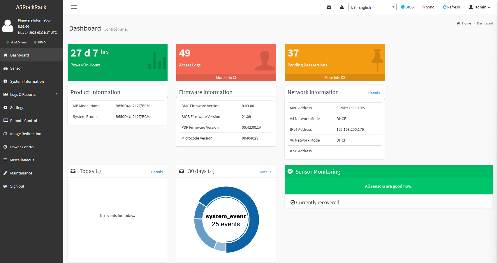
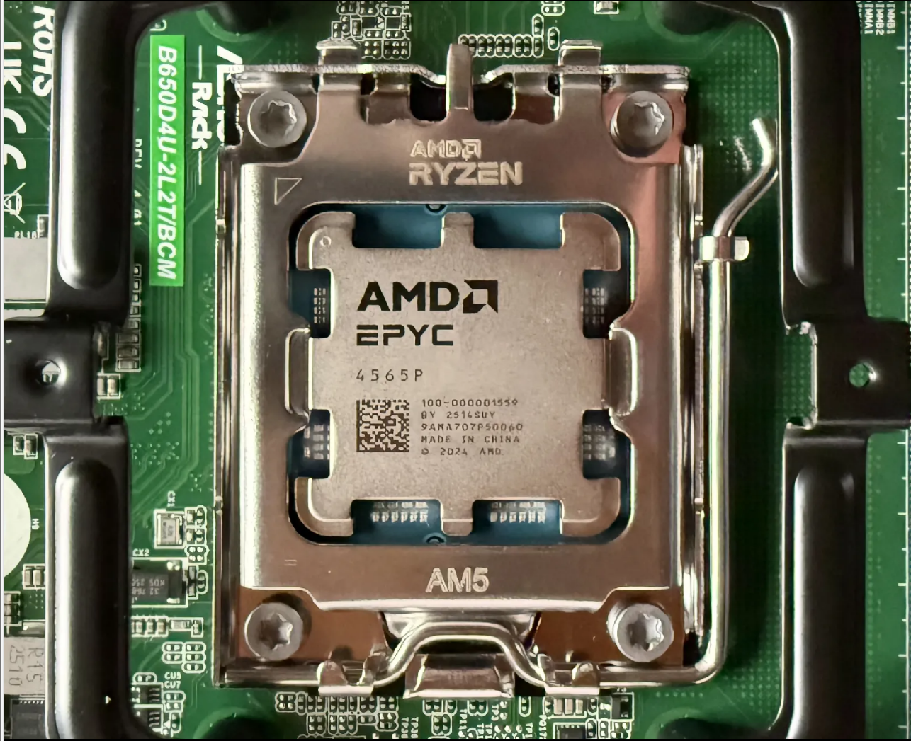
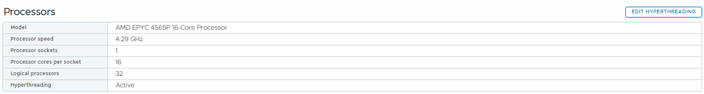
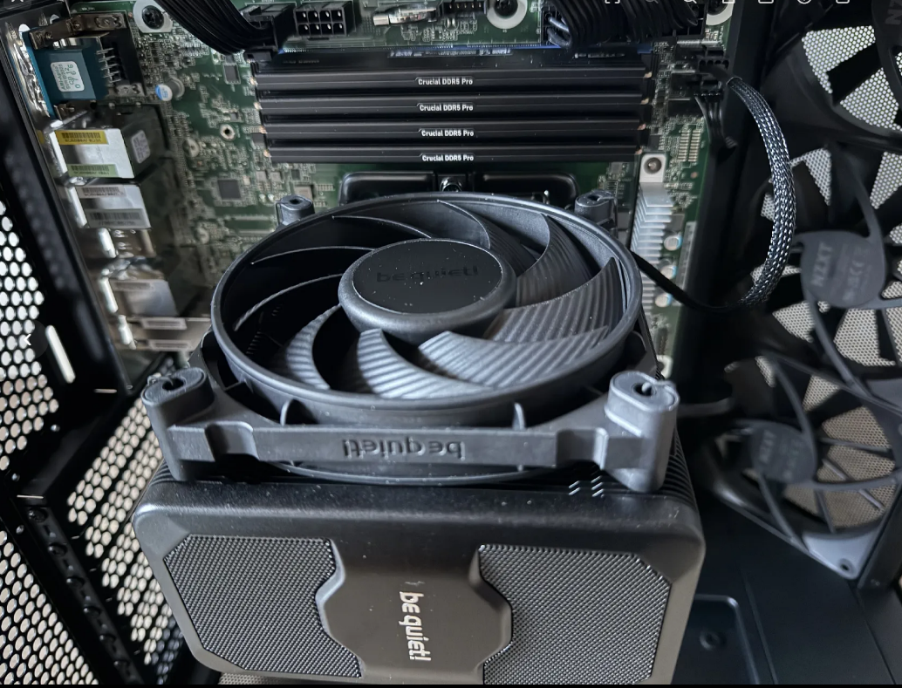
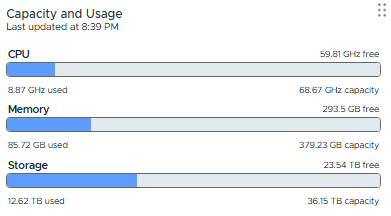
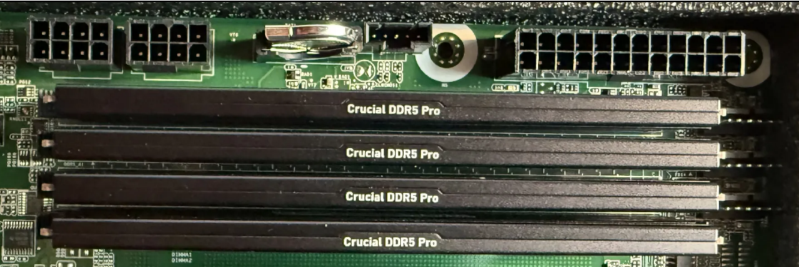
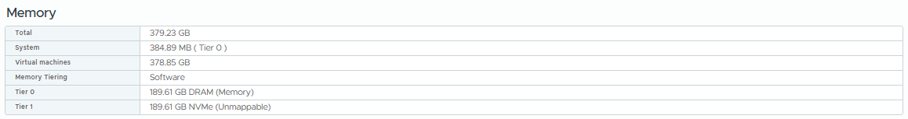
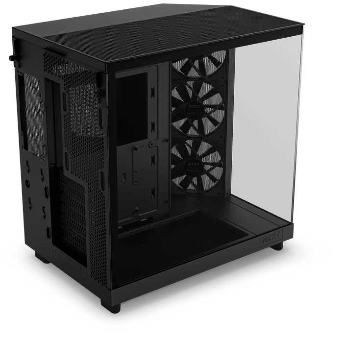
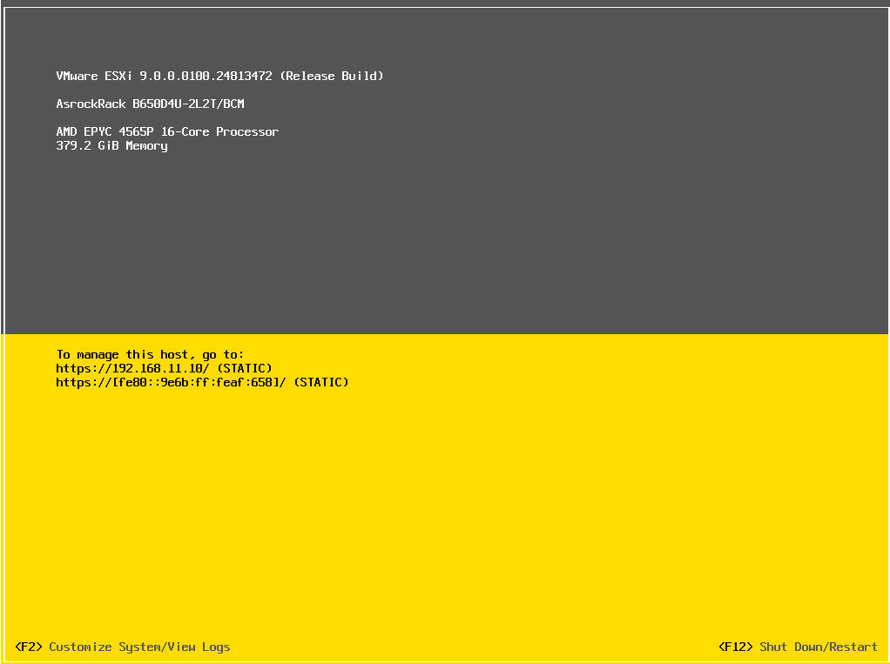

# Introduction

After years of running my Shuttle SH370R6 and SH370R8 as a home lab server ([see my 2019 build here](https://www.ivobeerens.nl/blog/2019/06/using-the-shuttle-sh370r8-as-home-lab-server-with-vmware-esxi/)), it was time for an upgrade to meet new virtualization demands. My goals for the new lab server build:
- Powerful hardware to efficiently run multiple nested hypervisor platforms such as:
    - **VMware Cloud Foundation (VCF)**
    - **Azure Local**
    - **HPE VM Essentials**
    - **Proxmox**
    - **Omnissa**
- Ability to test IaC, Packer, Terraform, Vault, and AI systems
- IPMI remote management for easy remote administration
- Low noise and efficient cooling
- Room for expansion cards such as a GPU

## Build of Materials (BOM)

Here are the components I used for this build:

| **Component**  | **Type / Model**                  | **Qty** | **Total Costs (€)** |
| -------------- | --------------------------------- | -------| ---:|
| Motherboard    | ASROCK B650D4U-2L2T/BCM           |      1  | 562,95 |
| CPU            | AMD EPYC 4565P, 4.3 GHz, 64 MB L3 |      1  | 683.23 |
| TPM module     | ASRock TPM2-SLI                   |      1  |  27,42 |
| CPU Cooler     | Be Quiet! DARK ROCK 5             |      1  |  71,08 |
| Memory         | Crucial PRO DDR5‑5600, 48GB       |      4  | 540,00 |
| PSU            | MSI MAG A850GL PCIE5, 850W ATX    |      1  | 105,99 |
| Disk NVMe      | Samsung SSD 990 PRO M.2, 4TB      |      1  | 314,68 |
| Disk HDD       | Seagate Barracuda, 24TB, 7200 RPM |      1  | 339,00 |
| Case           | NZXT H6 Flow black                |      1  |  95,90 |
---

The total hardware costs are around €2669,17. At the moment of writing this blog the hardware prices of DDR5 memory and SSDs are increased (almost the double) because of the great demand.

## Hardware components overview
---
***

### Motherboard

**ASRock B650D4U-2L2T/BCM**  
This Micro-ATX motherboard supports non-ECC memory, provides multi-GbE connectivity, and features integrated IPMI.
**Key specs:**
- Micro-ATX (9.6" x 9.6")
- Supports AMD EPYC 4005/4004 and Ryzen 9000/8000/7000 Series
- 4 memory slots (DDR5 ECC/non-ECC UDIMM)
- PCIe 5.0 ×16, PCIe 5.0 ×4, PCIe 4.0 ×1
- 1 × M.2 (PCIe 5.0 ×4)
- **Network:** 2 × 10 GbE (Broadcom BCM57416), 2 × 1 GbE (Intel i210)
- 4 × SATA 6 Gb/s
- HDMI & DisplayPort  
- Remote IPMI management interface.

All onboard M.2, SATA, and NIC (2 × 10 GbE Broadcom BCM57416, 2 × 1 GbE Intel i210) controllers are recognized out of the box by VMware ESXi. Remote management via IPMI makes installation and control hassle-free, without the need to purchase an extra license!

### CPU

The AMD EPYC 4565P is a powerful processor with the following specifications:
- **16 Zen 5 cores & 32 threads**
- Base clock: **4.3 GHz**
- L3 cache: **64 MB**
- Default TDP: **170 W**

<!--  -->

### CPU Cooler

The Be Quiet! DARK ROCK 5 is a large, silent, high-performance tower cooler.

With the current CPU and memory utilization the temperature is **47 °C**.

### Memory

- 4 × Crucial PRO DDR5‑5600 (CP48G56C46U5), 48GB modules (**total: 192 GB physical memory**).
- *Note:* Using all 4 DIMM slots drops memory speed to **3600 MHz**; with 2 slots, it can run at **5600 MHz**.
- System stability is excellent with this configuration.
- **NVMe memory tiering ``(1)``** enabled for additional virtual RAM capacity.

### PSU

MSI MAG A850GL PCIE5 power supply unit 850 W 20+4 pin ATX ATX black.
**Specs**:

- ATX 3.1 ready, native PCIe 5.1 dual-color 16-pin cable
- Supports NVIDIA® GeForce RTX 40 Series graphics cards
- Full modular design, flat cables.
- 80 Plus Gold certified for high efficiency
- Active PFC design,Industrial level protection with OVP,OCP,OPP,OTP, SCP,UVP
- 120mm Fluid Dynamic Bearing Fan

### Disks

The motherboard has only one NVMe slot, which is occupied by a Samsung SSD 990 PRO M.2 NVMe 4TB with heatsink.

As a backup disk, I installed a Seagate Barracuda Desktop 24TB HDD (7200 RPM, 512 MB cache, 3.5”).

For the NVMe tiering I used an PCIe NMVe expansion card from my old home lab configuration.

### Case

The NZXT H6 Flow Midi Tower black case has a dual-chamber design and has three pre-installed 120mm fans and Wraparound glass panels. Cable management is good, and the case is tool-free for easy access.

## Conclusion

Building a home lab server with custom hardware can be challenging, as you need to ensure all components are recognized by platforms like VMware VCF. All the critical hardware—CPU, memory, storage, and network controllers—was immediately recognized by VMware ESXi 9, making setup smooth and reliable.

However, there are some limitations at the moment. Running a full nested VCF 9 environment isn’t possible with “just” 192 GB of physical RAM. NVMe memory tiering (*1) does not work for nested ESXi hosts when Virtual Hardware-Assisted Virtualization is enabled. I hope future VMware updates will allow more flexible use of NVMe tiering for nested labs.

**Build highlights**:
- **Remote management**: No license is required to use all IPMI functions. 
- **Performance**: The AMD EPYC CPU offers the cores and RAM for extensive nested virtualization. NVMe memory tiering expands available memory for VMs.
- **Future ready**: “PCIe 5.0 and 10GbE LAN provide high-speed storage and networking options. All hardware is recognized out of the box.
- **Quiet System**: The selected components ensure low noise levels.
- **Expansion room**: There is space to add a GPU or other expansion cards.
- **Clean build**: Spacious case design ensures good airflow and a tidy setup.

> (1) Memory Tiering over NVMe (Memory Tiering) allows you to add memory capacity to an ESX host by using NVMe devices installed locally on the ESX host as tiered memory. It optimizes performance by intelligently allocating VM memory to either NVMe devices or faster dynamic random access memory (DRAM) in the ESX host.`` [source](https://techdocs.broadcom.com/us/en/vmware-cis/vsphere/vsphere/9-0/vsphere-resource-management/memory-tiering-over-nvme.html)