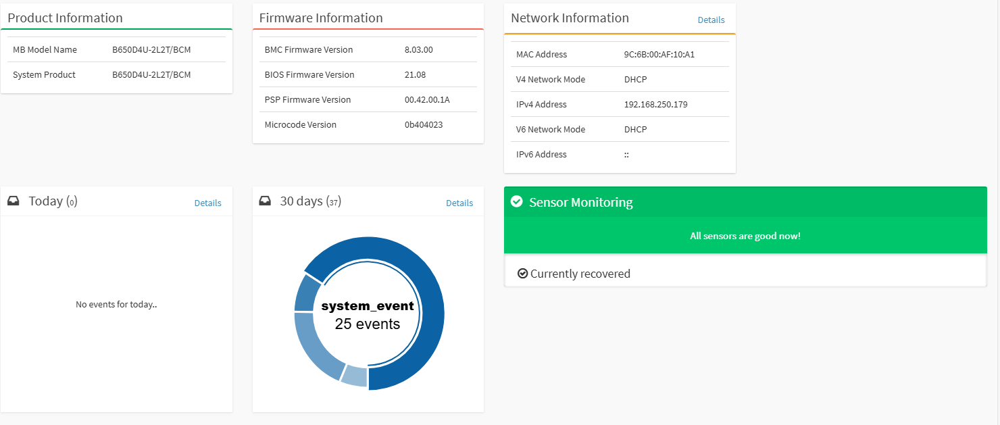

# Introduction

After years of running my Shuttle SH370R8 as a home lab server ([2019 build can be found here](https://www.ivobeerens.nl/blog/2019/06/using-the-shuttle-sh370r8-as-home-lab-server-with-vmware-esxi/)), it was time for an upgrade to meet new virtualization demands. My goals for the new lab server build:
- Powerful CPU to efficiently run multiple nested hypervisor platforms such as:
    - **VMware Cloud Foundation (VCF)**
    - **Azure Local**
    - **HPE VM Essentials**
    - **Proxmox**
    - **Omnissa**
- Test IaC, HashiCorp Packer, Terraform, Vault and AI systems
- IPMI remote management for easy remote administration
- Low noise and efficient cooling system
- Room for expansion cards such as a GPU

## Build of Materials (BOM)

Here is a list of components I used to build this home lab:

| **Component**  | **Type / Model**                  | **Qty** |
| -------------- | --------------------------------- | -------:|
| Motherboard    | ASROCK B650D4U-2L2T/BCM           |      1  |
| CPU            | AMD EPYC 4565P, 4.3 GHz, 64 MB L3 |      1  |
| TPM module     | ASRock TPM2-SLI                   |      1  |
| CPU Cooler     | Be Quiet! DARK ROCK 5, 12 cm      |      1  |
| Memory         | Crucial PRO DDR5‑5600, 48GB       |      4  |
| PSU            | MSI MAG A850GL PCIE5, 850W ATX    |      1  |
| Disk NVMe      | Samsung SSD 990 PRO M.2, 4TB      |      1  |
| Disk HDD       | Seagate Barracuda, 24TB, 7200 RPM |      1  |
| Case           | NZXT H6 Flow Midi Tower, black    |      1  |

---

## Hardware component overview

### Motherboard

**ASRock B650D4U-2L2T/BCM**  
A Micro-ATX platform, it has non-ECC memory support, multi‑GbE connectivity, and integrated IPMI.  
**Key specs:**
- Micro-ATX (9.6" x 9.6")
- Supports AMD EPYC™ 4005/4004 and Ryzen™ 9000/8000/7000 Series
- 4 memory slots (DDR5 ECC/non-ECC UDIMM)
- PCIe 5.0 ×16, PCIe 5.0 ×4, PCIe 4.0 ×1
- 1 × M.2 (PCIe 5.0 ×4)
- **Network:** 2 × 10 GbE (Broadcom BCM57416), 2 × 1 GbE (Intel i210)
- 4 × SATA 6 Gb/s
- HDMI & DisplayPort  
- Remote IPMI management interface

All onboard M.2., SATA and NIC controllers are recognized by VMware ESXi out-of-the-box. The remote management using IPMI makes system installation and control hassle-free.

### CPU

The AMD EPYC 4565P processor is a powerful CPU with the following specs:
- **16 Zen 5 cores & 32 threads**
- Base clock: **4.3 GHz**
- L3 cache: **64 MB**
- Default TDP: **170 W**

### CPU Cooler

The Be Quiet DARK ROCK 5 is a big, silent, high-performance tower cooler that keeps the CPU cool. 

With the current utilization the temperature is **47 °C**.

### Memory

- 4 × Crucial PRO DDR5‑5600, 48GB modules (**total: 192 GB physical memory**).
- *Note:* Using all 4 DIMM slots drops memory speed to **3600 MHz**; with 2 slots, it can run at **5600 MHz**.
- System stability is excellent with this config.
- **NVMe memory tiering ``(*1)``** enabled for additional virtual RAM capacity.

`` (*1) Memory Tiering over NVMe (Memory Tiering) allows you to add memory capacity to an ESX host by using NVMe devices installed locally on the ESX host as tiered memory. It optimizes performance by intelligently allocating VM memory to either NVMe devices or faster dynamic random access memory (DRAM) in the ESX host.`` [source](https://techdocs.broadcom.com/us/en/vmware-cis/vsphere/vsphere/9-0/vsphere-resource-management/memory-tiering-over-nvme.html)

### PSU

MSI MAG A850GL PCIE5 power supply unit 850 W 20+4 pin ATX ATX black.
**Specs**:

- ATX 3.1 ready, native PCIe 5.1 dual-color 16-pin cable
- Supports NVIDIA® GeForce RTX 40 Series graphics cards
- Full modular design,Flat cables
- 80 Plus Gold certified for high efficiency
- Active PFC design,Industrial level protection with OVP,OCP,OPP,OTP, SCP,UVP
- 120mm Fluid Dynamic Bearing Fan

### Disks

On the motherboard there is only one NVMe slot available. In this slot a Samsung SSD 990 PRO M.2 NVME 4TB with Heatsink is installed.

As backup disk I installed a Seagate Barracuda Desktop 24TB HDD 7200 RPM 512 MB 3.5" disk.

For the NVMe tiering I used an PCIe NMVe expansion card.

### Case

The NZXT H6 Flow Midi Tower black case has a dual-chamber design and has three pre-installed 120mm fans and Wraparound glass panels. The cable management is good and there are no tools needed for opening the case.

## Conclusion

Building a home lab server from custom hardware is always a challenge, especially when ensuring all components are recognized by platforms like VMware ESXi 9. In this project, all critical hardware—CPU, memory, storage, and network controllers—was recognized immediately by VMware ESXi 9, which made setup smooth and reliable.

However, there are some limitations. Running a full nested VCF 9 environment isn’t possible with “just” 192 GB of physical RAM, and NVMe memory tiering does not work for nested ESXi hosts when Virtual Hardware-Assisted Virtualization is enabled. I hope future VMware updates will allow more flexible use of NVMe tiering for nested labs.

**Build highlights**:
- Remote management: IPMI made installation and troubleshooting easy.
- Performance: The AMD EPYC CPU offers the cores and RAM for extensive nested virtualization. NVMe memory tiering expands available memory for VMs.
- Future ready: PCIe 5.0 and 10GbE deliver high-speed storage and network options.
- Quiet: The selected components keep noise low.
- Expansion potential: There’s room to add a GPU or other expansion cards.
- Clean build: Spacious case design ensures good airflow and a tidy setup.