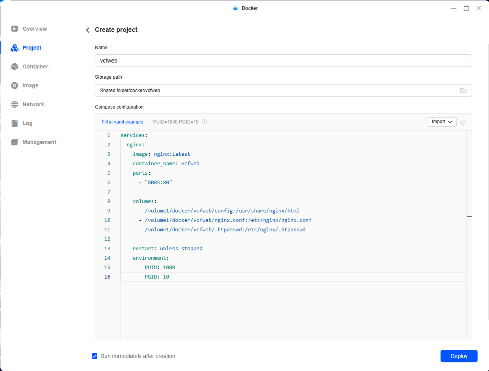
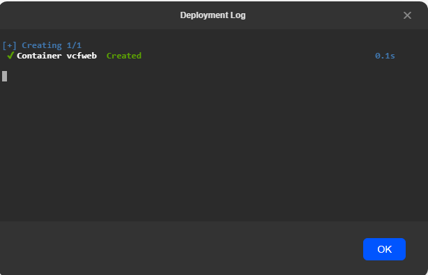
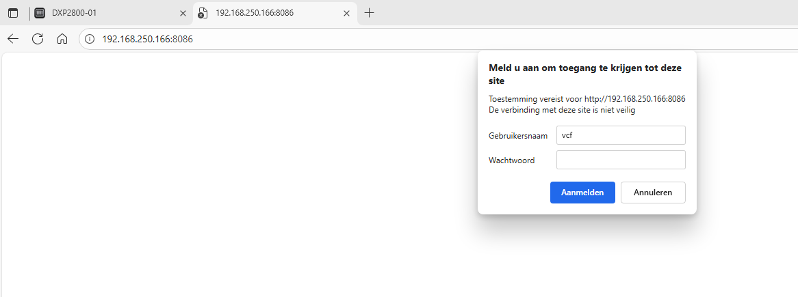
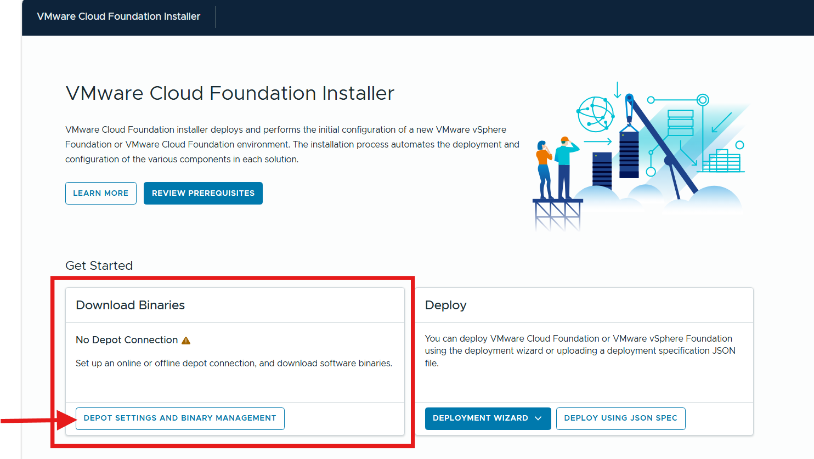
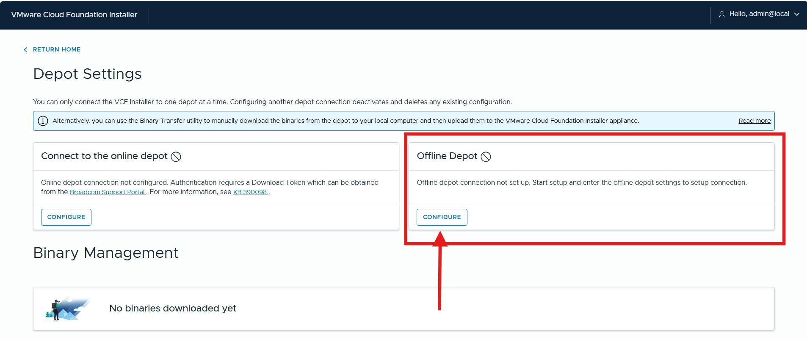
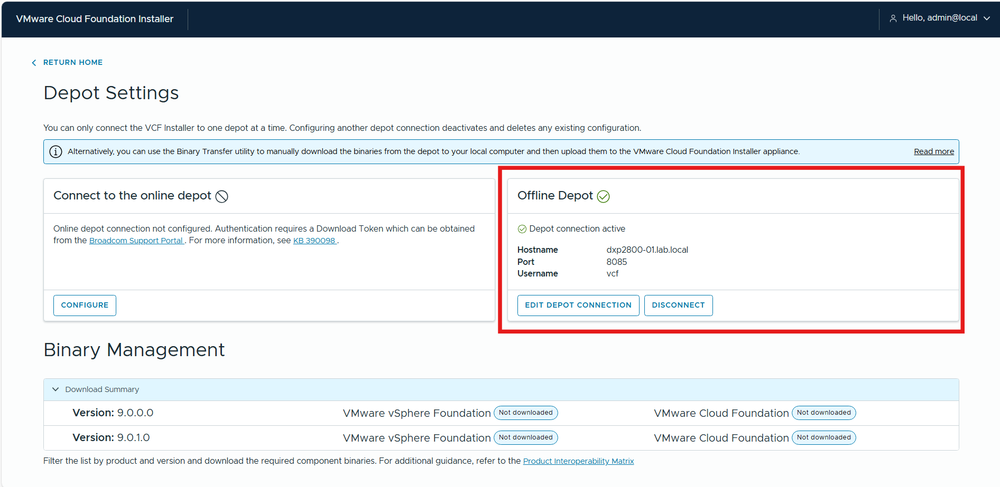
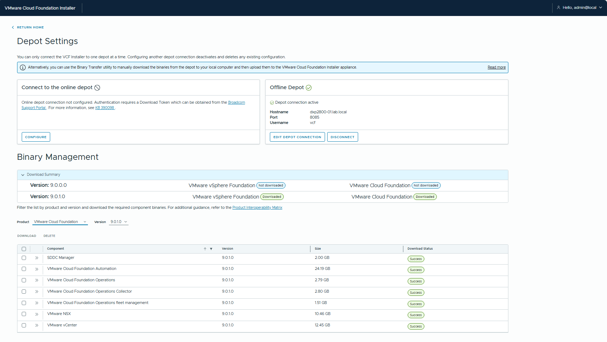

# Introduction

In my home lab, I have a UGREEN DXP2800 NAS. I wanted to create an Offline Depot for VMware Cloud Foundation or VMware vSphere Foundation. Most blogs are running an Ubuntu VM with Apache as web server.

I didn't want to use an Ubuntu VM as web server. I use a small NGINX container that is running on the NAS as offline depot web server without requiring certificates. 

The VCF Download Tool (VCFDT) will be used for downloading, installing and upgrading VCF components. With the VCFDT you can enable Update Manager Download Service (UMDS) for downloading an ESX software depot that is backwards compatible.

The last step is to configure the VMware Cloud Installer appliance (SDDC Manager). We will disable the HTTPS requirement for the Offline Depot.

## 1. Setup the Web Server

For the web server a NGINX container will be configured. Here are the steps:

- Open the web portal of the UGREEN NAS
  - In the App Center, search for Docker and install Docker.
  - Open `Control Panel`, select `Terminal`, and enable the `SSH protocol` on port `22`.
- Download the vcfweb folder from my GitHub [repository](https://github.com/ibeerens/vcfweb) and transfer the repo to the docker folder `/volume1/docker` on the UGREEN NAS. I use [WinSCP](https://winscp.net/eng/download.php) for transfering the folder to the UGREEN NAS.
- Make an SSH connection to the NAS and perform the command 'id'
```
ibeerens@DXP2800-01:~$ id
uid=1000(ibeerens) gid=10(admin) groups=10(admin),100(users),133(ughomeusers)
```

- In the web UI of the UGREEN NAS:
  - Open Docker
  - Copy the vcfweb folder under the Docker folder
  - In Docker on the NAS and select `Project`
  - Select `Create`:
    - Paste the following Docker compose file and match the `PUID` and `PGID` with the IDs from the ID command:

```
services:
  nginx:
    image: nginx:latest
    container_name: vcfweb
    ports:
      - "8085:80"

    volumes:
      - /volume1/docker/vcfweb/config:/usr/share/nginx/html
      - /volume1/docker/vcfweb/nginx.conf:/etc/nginx/nginx.conf
      - /volume1/docker/vcfweb/.htpasswd:/etc/nginx/.htpasswd

    restart: unless-stopped
    environment:
        PUID: 1000
        PGID: 10
```




  - Name = `vcfweb`
  - Storage path: browse to `/volume1/docker/vcfweb`
- Select `Deploy` and the container will be created



- Use the SSH connection to the UGREEN NAS and enter the following command: 
`sudo chmod 755 /volume1/docker/vcfweb`  
- In the web browser enter the NAS IP with the port number
`http://192.168.250.166:8086/`  
- Check if the webpage with authentication is displayed. The authentication is:
  - username: `vcf`
  - password: `VCFdepot`



Create your own passwords with a .httpd password generator such as [.htpasswd Generatorr](https://codeshack.io/htpasswd-generator/). The NGINX webserver is now running.

## 2. Configure VCF Download Tool (VCFDT) and UMDS

The VCF Download Tool (VCFDT) and VMware Update Manager Download Service (UMDS) are used to download the VCF components and vSphere patches.
- Download the `vcf-download-tool-9.0.1.0.24962179.tar.gz` from the Broadcom website and upload the file `/volume1/docker/vcfweb/vcfdt` folder.
- Open the SSH connection to the UGREEN NAS and go to the following folder
`/volume1/docker/vcfweb/vcfdt` and perform the following command:
`tar -xvf vcf-download-tool-9.0.1.0.24962179.tar.gz`
- Copy the download token from the Broadcom website and create a file named 'downloadtoken.txt' and save this in the `/volume1/docker/vcfweb` folder

Perform the following command to download binaries needed by VCF Installer for deploying VCF instance:

`sudo /volume1/docker/vcfweb/vcfdt/bin/vcf-download-tool binaries download --depot-download-token-file=/volume1/docker/vcfweb/downloadtoken.txt --depot-store /volume1/docker/vcfweb/config/PROD --vcf-version=9.0.1 --automated-install --type=install --ceip=disable`

**Download vSphere binaries**

Use the VCF Download Tool UMDS commands to install UMDS and list, download and manage ESX binaries and metadata.
`sudo /volume1/docker/vcfweb/vcfdt/bin/vcf-download-tool umds install`

`sudo /volume1/docker/vcfweb/vcfdt/bin/vcf-download-tool umds run -S --add-entitlement-token <enter the download token>`  

`sudo /volume1/docker/vcfweb/vcfdt/bin/vcf-download-tool umds run -S --patch-store /volume1/docker/vcfweb/config/umds-patch-store/`

The default Host platforms will be downloaded are:
```
embeddedEsx-9.0-INTL
embeddedEsx-9.0.1-INTL
esxio-8.0-INTL
esxio-9.0-INTL
esxio-9.0.1-INTL
embeddedEsx-7.0-INTL
embeddedEsx-8.0-INTL
```
- We only need the ESX 9 bits, so we disable all the host platforms and enable ESX 9 with the following commands: 

`sudo /volume1/docker/vcfweb/vcfdt/bin/vcf-download-tool umds run -S --disable-host`

`sudo /volume1/docker/vcfweb/vcfdt/bin/vcf-download-tool umds run -S -e embeddedEsx-9.0-INTL`

- To start the download use the following command:  

`sudo /volume1/docker/vcfweb/vcfdt/bin/vcf-download-tool umds run vmware-umds -D`

More information can be found here: [VCF download tool](https://techdocs.broadcom.com/us/en/vmware-cis/vcf/vcf-9-0-and-later/9-0/lifecycle-management/what-is-the-vcf-download-tool-.html)

## 3. Configure the VMware Cloud Foundation Installer appliance

After installing the VMware Cloud Installer appliance (SDDC Manager), we will disable the HTTPS requirement.This makes the configuration easier.

- SSH to the VMware Cloud Foundation Installer appliance
- Perform the following commands:

`sudo`

`echo "lcm.depot.adapter.httpsEnabled=false" >> /opt/vmware/vcf/lcm/lcm-app/conf/application-prod.properties`

`systemctl restart lcm`

- Log in to the VMware Cloud Foundation Installer.
- Select `Depot settings and binary management`
  



- Select `Offline depot` to configure  



- Enter Offline depot credentials:
  - `FQDN or IP Address`  
  - `Port`  
  - `Username`  
  - `Password`    


- If everything is ok, the Offline Depot checkmark is green.



- Select the product and version and download all the components. This can take a while.



## Conclusion

After configuring these steps, you have an Offline Depot for VMware Cloud Foundation or VMware vSphere Foundation hosted on an UGREEN NAS with a NGINX Docker container. The VMware Cloud Foundation Installer will connect by HTTP so no certificates are needed.
